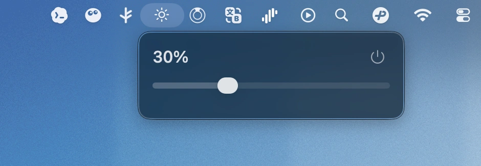

[English](README.md) | [简体中文](README.zh-CN.md)

# 拾光

<p align="center">
  
</p>

拾光是一款 macOS 菜单栏小工具，通过键盘亮度按键直接调节外接显示器的硬件亮度。

<p align="center">
  
</p>

目前项目主要在以下环境中开发和测试：

- 运行设备：Mac mini M4
- 显示器：Redmi G27U
- 系统：macOS 26.4.1

其他 Mac 型号、外接显示器和连接方式暂未完整测试。如果你的显示器不支持 DDC/CI，或者 macOS 无法通过当前接口访问显示器亮度，拾光可能无法正常工作。

## 功能特性

- 使用键盘亮度增加/降低按键调节外接显示器亮度
- 每次按键按 5% 步进调整亮度
- 调整时自动显示当前亮度百分比
- 常驻 macOS 菜单栏，不占用 Dock
- 菜单栏图标显示为系统太阳图标
- 点击菜单栏图标可查看当前亮度
- 支持通过菜单中的滑块手动调节亮度
- 菜单中提供快速退出按钮
- 自动记住上次亮度，并在下次启动时尝试恢复
- 显示器或系统唤醒后会重置连接状态，提升后续控制成功率
- 基于 DDC/CI 控制显示器硬件亮度，不是简单叠加屏幕滤镜

## 使用说明

启动拾光后，它会出现在 macOS 菜单栏中。

首次运行时，系统可能会要求授予“辅助功能”权限。这个权限用于监听键盘上的亮度按键。授权后，可以直接使用键盘亮度增加/降低按键调节外接显示器亮度。

也可以点击菜单栏中的太阳图标，通过滑块手动调整亮度。

## 安装方式

目前项目没有使用 Apple Developer 开发者账号进行签名和公证，因此 macOS 可能会提示应用来自未识别开发者。这是预期现象。

推荐安装流程：

- 从 GitHub Releases 下载最新的 `.dmg` 安装包
- 打开 `.dmg`
- 将 `拾光.app` 拖动到“应用程序”文件夹
- 前往“应用程序”中找到 `拾光`
- 首次打开时，如果系统直接拦截，可以按住 `Control` 键并点按应用，再选择“打开”

如果仍然被系统阻止，可以按下面方式处理：

- 打开“系统设置”
- 进入“隐私与安全性”
- 在底部找到与 `拾光` 相关的安全提示
- 点击“仍要打开”或类似按钮

首次正常启动后，系统还可能请求“辅助功能”权限。允许后，键盘亮度按键监听功能才能正常工作。

## 兼容性说明

拾光目前优先面向以下场景：

- Apple Silicon Mac
- macOS 菜单栏应用
- 外接显示器
- 支持 DDC/CI 亮度控制的显示器

当前已知测试环境是 Mac mini M4 + Redmi G27U。其他设备理论上可能可用，但暂未验证。

如果遇到无法调节亮度，常见原因包括：

- 显示器未开启 DDC/CI
- 显示器、转接器、扩展坞或线材不支持 DDC 通信
- 当前 macOS 版本对底层显示器控制接口有限制
- 使用的是内建屏幕，而不是外接显示器

## 维护说明

此小工具以个人使用状态而更新，主要服务于自己的日常使用场景。

## 更新日志

查看 [CHANGELOG.md](CHANGELOG.md)。

## 构建

本项目使用 Xcode 开发。

可以通过 Xcode 打开：

```bash
open ShiGuang.xcodeproj
```

也可以使用命令行构建：

```bash
xcodebuild -project ShiGuang.xcodeproj -scheme ShiGuang -configuration Release build
```

## 开源协议

本项目基于 MIT License 开源。
